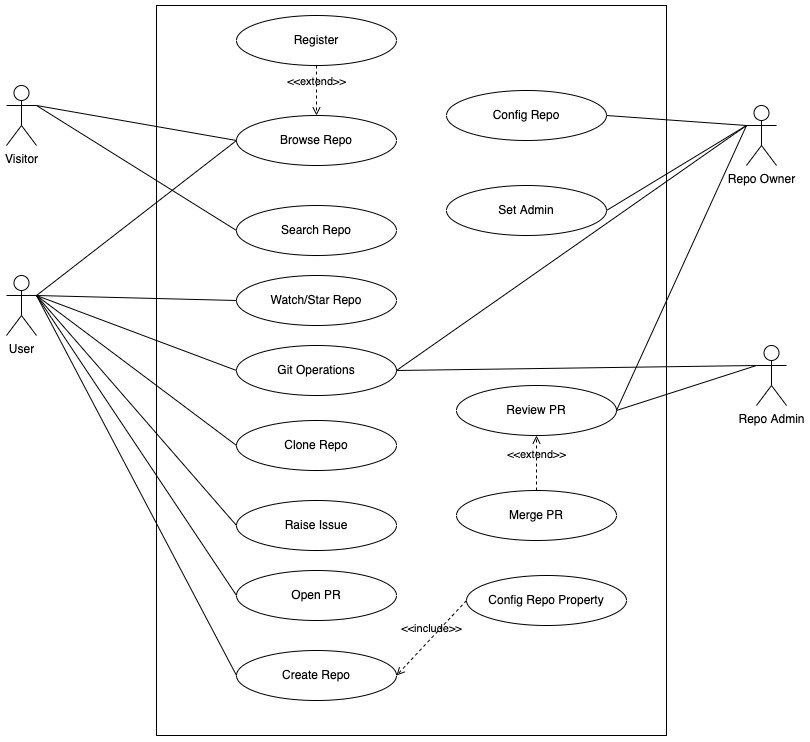
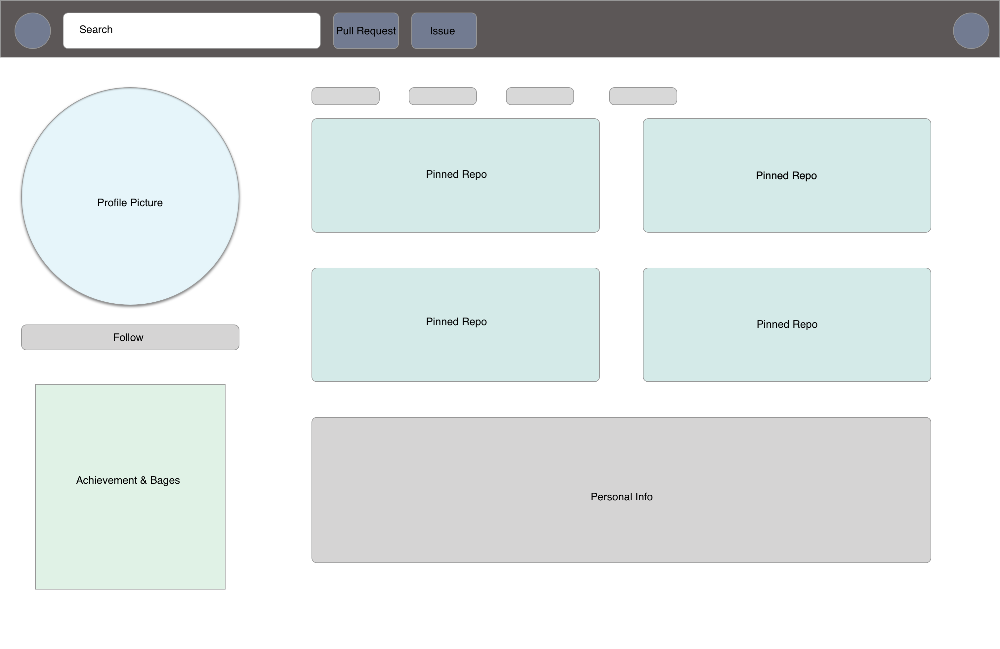
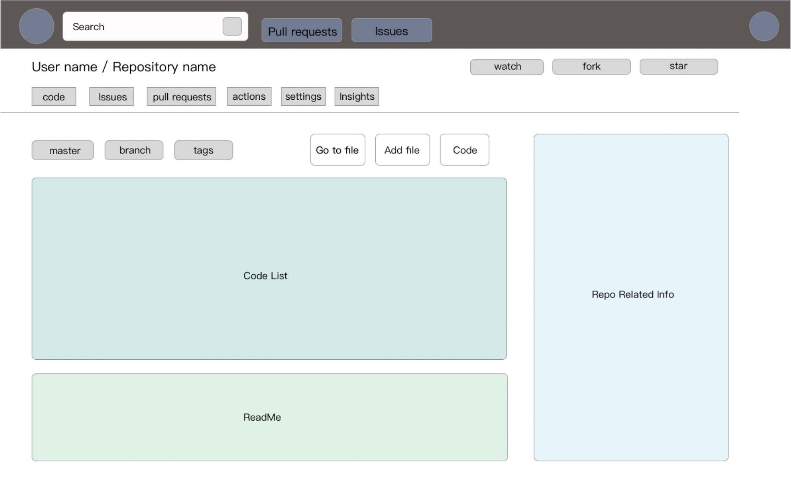
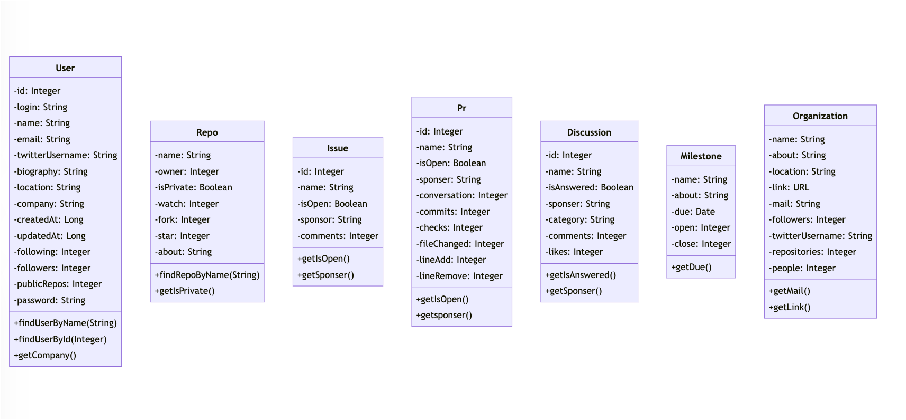
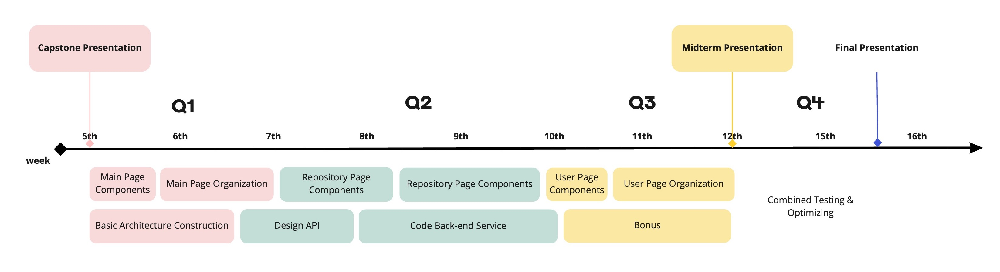

# Liquid: a Code Hosting Platform

## Abstract

With the increasing needs of software development and the scale enlarging, code hosting platforms have became popular tools for assisting version control, collaboration and delivery. Existing platforms such as GitHub or GitLab provide basic functionality of git version control along with other features to public, GitHub itself is not open-source. Analyzing some protential open-source competitors, such as GitLab, which possess a rather user unfriendly interaction, and BitBucket, which has certain restrains such as a limitation of number of buckets and users. This project was intended to build a similar and lighter platform for development teams which can be deployed privately and conveniently, therefore eliminate the functional restrictions and solves the code security problem.

### Feature

1. 

### User Stories

#### For visitors：

1. **(P1)**As a visitor, I want to browser repository so that I can view others' codes or participate in development.

- I search for the repository in the input box
- A window jumps out with the list of all related repositories
- I scroll the page to view more repositories
- I can click each repository to open the repository page
- I can click on specific files and view the raw content of them

2. **(P1)**As a visitor, I want to register so that I can access more function of the website.
   - I click the button to sign up

   - A window jumps with input boxes

   - I enter my information in the input boxes

   - I click the submit button

   - A window jumps out with the information that I have registered successfully.

#### For users:

1. **(P1)**As a user I want to search public repositories so that I can use it for better development and collaboration.
   - I log into my account
   - I search for the repository in the input box
   - A window jumps out with the list of all related repositories
   - I scroll the page to view more repositories
   - I can click each repository to open the repository page
2. **(P1)**As a user, I want to clone public repositories so that I can participate the developement process.
   - I open a repository page
   - I click a button to clone the repository
   - A window jumps out letting me choose the position to clone
   - I choose the directory and submit
3. **(P1)**As a user, I want to perform git operations so that I can modify the repositories.
   - I open my terminal
   - I enter the git command
   - I recieve the prompt message
4. **(P2)**As a user, I want to open the issue so that I can contribute to the repository.
   - I log into my account
   - I choose one of my repositories
   - A window jumps out with the page of the repository
   - I can click the issue button to see all the issues
   - A window jumps out with the list of all issues
   - I click the button to open an issue
5. **(P3)**As a user, I want to open pull request so that I can contribute to the repository.
   - I log into my account
   - I choose one of my repositories
   - A window jumps out with the page of the repository
   - I click the pull request button
   - A window jumps out with all pull requests in history
   - I click a button to new a pull request
   - I input all information of the pull request and submit
   - A window jumps out with the list of all updated pull requests

#### For  repository owner

1. **(P2)**As a repository owner, I want to modify my repositories’ settings  so that I can use it for better development and collaboration.
   - I log into my account

   - I click a button to view the list of all my repositories

   - A window jumps out with the list of all my repositories

   - I choose one repository

   - The repository's window jumps out with its content.

   - I click the setting button

   - A window jumps out with all properties I can modify

   - I modify some terms

   - A window to ensure the modified information jumps out

   - I click the confirm button

#### For  repository administrator

1. (P)As a repository administrator, I want to review so that projects can be developed.
   - I log into my account
   - I choose one of my repositories
   - A window jumps out with the page of the repository
   - I can click a button to see all committed history
   - A window jumps out with all committed history
2. As a repository administrator, I want to merge pull requests so that the new modification can be added to repository.
   - I log into my account
   - I choose one of my repositories
   - A window jumps out with the page of the repository
   - I can click the pull request button
   - A window jumps out with all submitted pull requests
   - I can merge them
   - The repository can update the file

### User Cases

### Mockups

To satisfied the above functionality requirements, several UI pages model have been demostrated and worked as a guidance for front-end page layout design.

* User Main Page

  The user main page below consists of several parts that serves as certain functions targeting at the specific user, namely the user him/herself. The above header works as a constant quick navigation panel which enables user to guide back to certain parts such as search page, pull request/issue lists related to user conveniently. The profile picture and personal info section offers customizeable features for users to present themselves in their intended way. The follow button offers a convenient way to follow user for visitors to the user main page, and the achievement & bage section offers a view of the user's achievement and works as a motivation. As for those pinned repositories, users are free to customize them with the repo either they created or forked for quick access. More detailed functions and minor adjustments will appear in the final outcome of the front-end pages.

* Repository Page

  Apart from the user main page mentioned above, another important page layout is the repository main page,  which serves as an entrance to a specific repo. The quick navigation panel on top part of the page layout remains, while more information related to the repo is listed below. The watch, fork and star buttons provides quick operations for user visiting this page, while the button such as code, issue, etc, further divides the repository page into subsections according to workloads. Code lists provides a quick view of the repository root directory structure and readme offers a guidence and introduction to the repository customizeable by users. The page also contains quick selection for branch, tags and also a repository related information displayed automatically.

  

## Requirements

### Functional Requirements

The website provides functionality for users to interact with others (open source community).

The website provides basic git functions for users to operate on repositories.

Users can view raw content and git commit histories on the website.

The server is able to update repositories via git protocal by clients.

### Non-functional Requirements

The whole project (micro services) should be easy to deploy.

The project should be highly extendable.

The cost of scaling the system to accommodate more users should be low.

The cost of communitations between services should be low.

### API：

#### Authentication APIs：

Login:POST ~/login

Logout:POST ~/logout

#### Repository APIs:

Repository page: GET ~/{user_name}/{repository_name}

Repository issue: GET ~/{user_name}/{repository_name}/issues

Repository Pull requests: GET ~/{user_name}/{repository_name}/pulls

Repository discussions: GET ~/{user_name}/{repository_name}/discussions

Repository setting: POST ~/{user_name}/{repository_name}/setting

Repository file: GET ~/{user_name}/{repository_name}/tree/main/{file_name}

#### Pull Request APIs:

Pull Requests page: GET ~/{user_name}/{repository_name}/pull/{pr_id}

Pull Requests Commits: Get ~/{user_name}/{repository_name}/pull/{pr_id}/commits

#### Issues APIs:

Issues Page: GET ~/{user_name}/{repository_name}/issues/{issue_id}

#### Discussions APIs:

Discussions Page: GET ~/{user_name}/{repository_name}/discussions/{discussion_id}

#### User APIs:

Users Page: GET  ~/{user_name}

#### Setting APIs:

Profile Setting: POST ~/setting/profile

Count Setting: POST ~/setting/admin

Appearance Setting: POST ~/setting/appearance

## Design

### Class Diagram

To fulfill the requirements of the functions mentioned above,  7 classes are developed in backend for distinguishing different object and their correlated properties, methods. And the class diagram is shown below,

### Front-end Techniques

For front-end development we use Vue to manage router and use UI library such as Arco Design and TDesign. We also use Vuex for front-end safe storage on the user sides. For the interaction with backend, we use Axios encapsuled in Request to process some of the shared operations. An additional API layer is used for unified request management.

### Timeline

As an approach to motivate us and offering a clear view of the developing process, we plan out the timeline below according to different tasks for front-end and back-end seperately. For front end the main workloads consists of page components layout and organizations as well as the connection with the backend, while for backend they are consists of architecture analysis and construction, API designing and service implementation as well as some of the bonus part.

